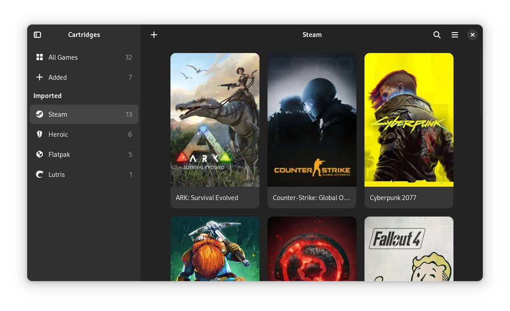

[discord-url]: https://discord.gg/yrJfddyt56
[discord-image]: https://img.shields.io/discord/1088155799299313754?color=%235865F2&label=discord&logo=discord&logoColor=%23FFFFFF&style=for-the-badge

> [!IMPORTANT]
> Please use [Codeberg](https://codeberg.org/kramo/cartridges) for issues and pull requests.
> The GitHub repository is a [mirror](https://en.wikipedia.org/wiki/Mirror_site).

<div align="center">
  

  # Cartridges

  A GTK4 + Libadwaita game launcher

  [![Discord][discord-image]][discord-url]

  
</div>

# The Project

Cartridges is an easy-to-use, elegant game launcher written in Python using GTK4 and Libadwaita.

## Features

- Manually adding and editing games
- Bulk-importing game shortcuts from a folder (Windows):
  - `.lnk` shortcuts (classic executables)
  - `.url` internet shortcuts (Steam, Epic, Ubisoft Connect, …)
  - `.lnk` shortcuts to Microsoft Store/UWP apps (Xbox, …)
- Cleaning up imported titles (stripping "Windows", "DX11", "DX12" and similar)
- Fetching the title, developer, publisher and release date from the Steam API
- High-resolution cover art by default
- Filtering games by source
- Searching and sorting by title, date added and last played
- Hiding games
- Automatically downloading cover art from [SteamGridDB](https://www.steamgriddb.com/)
- Searching for games on various databases
- Animated covers (played on hover)

For updates and questions, join our [Discord server][discord-url]!

## Donations
I accept donations through [GitHub Sponsors](https://github.com/sponsors/kra-mo) and [Liberapay](https://liberapay.com/kramo).

Thank you for your generosity! 💜

# Installation

### From Releases

1. Download the latest release from [GitHub Releases](https://github.com/kra-mo/cartridges/releases).
2. Run the downloaded installer.

Note: Windows might present you with a warning when trying to install the app. This is expected, just ignore the warning.

### Winget

Install the latest release with the command: `winget install cartridges`.

## Building manually

See [Building](https://codeberg.org/kramo/cartridges/src/branch/main/CONTRIBUTING.md#building).

### Build dependencies (MSYS2 UCRT64)

The Windows build is done from the MSYS2 UCRT64 shell. On top of GTK 4 and libadwaita, install:

```bash
pacman -S mingw-w64-ucrt-x86_64-python-pip
pacman -S mingw-w64-ucrt-x86_64-python-cryptography
/c/msys64/ucrt64/bin/python.exe -m pip install --break-system-packages tinytuya
```

`python-pip` because the MSYS2 Python does not ship pip. `tinytuya` is what the app uses to talk to the Tuya LED strips, and `python-cryptography` is its runtime dependency — without it every exchange with the strips fails.

# Contributing

See [CONTRIBUTING.md](https://codeberg.org/kramo/cartridges/src/branch/main/CONTRIBUTING.md).

# Code of Conduct

The project follows the [GNOME Code of Conduct](https://conduct.gnome.org/). 

Cartridges' contributors stand with Palestine, Ukraine and all other victims of imperialism and war, and believe trans rights are human rights. If this bothers you, this is probably not the best project for you to contribute to.

See [CODE_OF_CONDUCT.md](https://codeberg.org/kramo/cartridges/src/branch/main/CODE_OF_CONDUCT.md).
