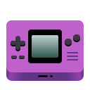
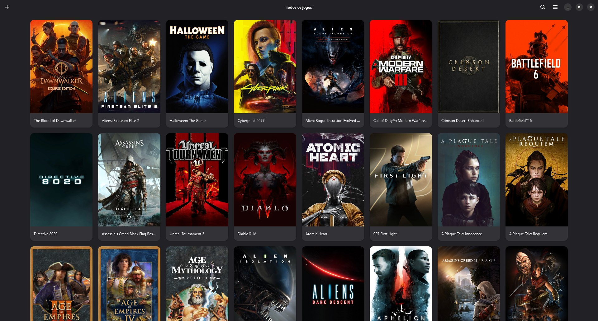
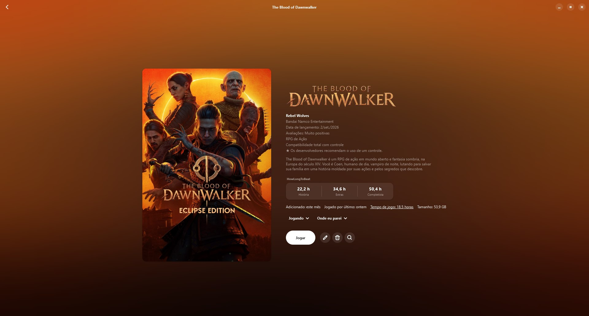
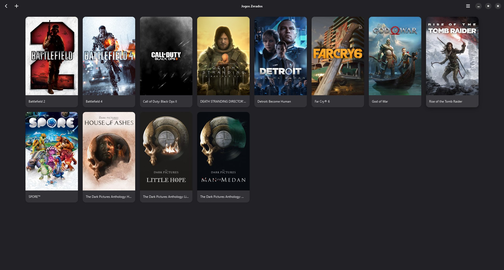
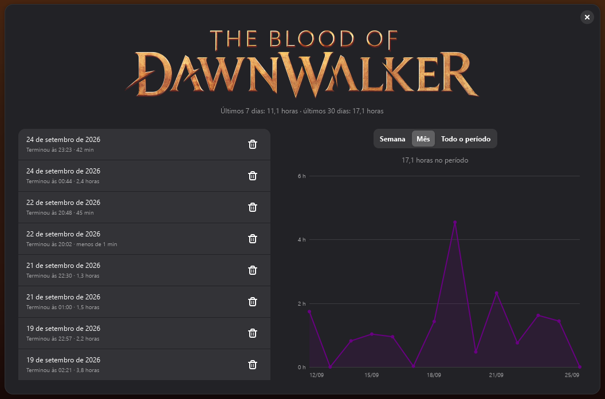
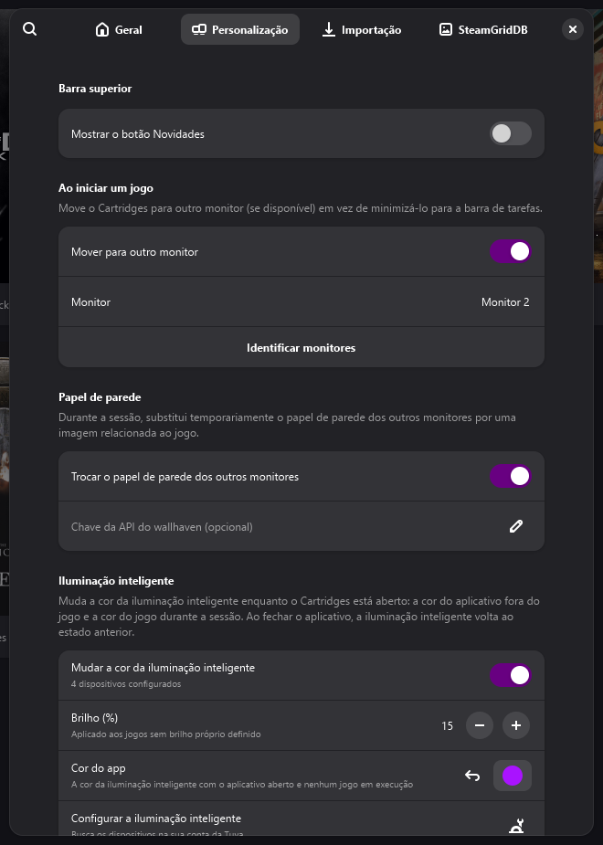

<div align="center">
  

  # Cartridges

  Seus jogos em um só lugar — launcher de jogos para Windows, em GTK4 e Libadwaita
</div>

Este é um fork da versão para Windows do [Cartridges](https://codeberg.org/kramo/cartridges), o launcher
criado por kramo para o GNOME. O projeto original (abandonado) reúne jogos de vários launchers do Linux; esta
versão reúne os jogos de um PC com Windows a partir de uma pasta de atalhos e acrescenta novas funções como:
acompanhamento de tempo de jogo por sessão, registro pessoal de cada jogo,
metadados da Steam e do HowLongToBeat, navegação por controle Xbox, papel de parede,
busca por capas e logos da Steam e controle de iluminação inteligente
que acompanham o jogo aberto, além de backup completo e atualização automática.

A interface é inteiramente em português do Brasil.



## Recursos

### Biblioteca e importação

- Importa uma pasta de atalhos, com ou sem subpastas:
  - atalhos `.lnk` de executáveis comuns;
  - atalhos de internet `.url` (Steam, Epic, Ubisoft Connect e outros);
  - atalhos de aplicativos da Microsoft Store e do Game Pass.
- Importação automática ao abrir o aplicativo, e remoção automática dos jogos desinstalados (opcional).
- Limpeza dos títulos importados (remove sufixos como "Windows", "DX11", "DX12" e "(DirectX 12)").
- Um jogo continua reconhecido quando o destino do atalho muda — atualização instalada, pasta
  movida, executável trocado —, sem perder tempo de jogo, capa, logo nem histórico.
- Jogos adicionados manualmente, com seletor de executável e opção "Abrir como administrador".
- Busca por título, desenvolvedora, publicadora e anotação.
- Ordenação por título, data de adição, jogados recentemente, mais jogados, data de lançamento,
  nota pessoal e tamanho no disco.
- Filtros por gênero, ano de lançamento e status, combináveis entre si e com a busca.
- Grade com número de colunas acompanhando a largura da janela, e capas que deslizam até a nova
  posição quando a grade se reorganiza.
- Navegação suave e agradável.

### Metadados e imagens

- Da Steam: título, desenvolvedora, publicadora, data de lançamento, gênero (pelas etiquetas da
  loja), descrição em português, avaliações, Metacritic, compatibilidade com controle e o selo
  "Gamepad Recomendado".
- Do [HowLongToBeat](https://howlongtobeat.com): tempos de História, Extras e Completista.
- Do [SteamGridDB](https://www.steamgriddb.com): capas em alta resolução, capas animadas
  (reproduzidas ao passar o mouse) e logos para o topo da tela de detalhes.
- "Atualizar metadados" e "Atualizar capas" para a biblioteca já importada, buscando só o que
  falta ou relendo tudo, com andamento e cancelamento.
- Campos editados manualmente não são sobrescritos pela busca automática.
- Capa e logo também podem vir de um arquivo do computador.
- Atalhos para buscar o jogo no IGDB, no SteamGridDB, no PCGamingWiki e no HowLongToBeat.

### Tela de detalhes

- Capa, logo, fundo desfocado, datas, tempo de jogo e tamanho no disco.
- Botão para abrir a pasta de instalação do jogo, quando ela pode ser determinada.



### Registro pessoal de cada jogo

- Status: "Quero jogar", "Jogando", "Zerado" ou "Abandonado", alterado com um clique.
- Nota pessoal de uma a cinco estrelas.
- Anotação livre "Onde eu parei", acessível pela tela de detalhes, pela janela do jogo em
  andamento e pelo aviso de fim de sessão.
- **Jogos Zerados**: os jogos desinstalados marcados como Zerado continuam no aplicativo, com capa,
  informações, nota e histórico de sessões. Quando o jogo é reinstalado, os dois registros se unem.
  Jogos também podem ser adicionados diretamente na tela de zerados, buscados na Steam ou
  somente pelo nome.



### Tempo de jogo e sessões

- O tempo é contado automaticamente, observando o processo do jogo: pelo executável, pela pasta
  de instalação ou pelo pacote da Microsoft Store. Jogos com lançador separado ou que trocam de
  executável são acompanhados corretamente.
- Jogos abertos por um link de loja usam uma janela compacta para encerrar a sessão.
- Cada sessão é registrada individualmente: data, hora de término e duração.
- O histórico de sessões mostra um gráfico de horas por dia (semana, mês ou todo o período) e o
  total dos últimos 7 e 30 dias. Uma sessão pode ser excluída, e o tempo dela é descontado do total.
- O PC suspenso com o jogo aberto não conta como tempo de jogo, e um reinício rápido do jogo não
  divide a sessão.



### Durante a sessão

Todos estes recursos ficam na aba Personalização das Preferências e vêm desativados por padrão.

- **Outro monitor**: ao iniciar um jogo, a janela pode ir maximizada para outro monitor, com um
  relógio contando o tempo da sessão. Ao final, ela volta ao monitor e ao tamanho de antes.
- **Papel de parede**: os monitores além do principal podem exibir a arte do jogo, buscada no
  [wallhaven](https://wallhaven.cc) ou escolhida manualmente, com ajuste de enquadramento para
  monitores em retrato e em paisagem. Ao final da sessão, cada monitor volta ao papel de parede
  que tinha.
- **Iluminação inteligente Tuya**: a iluminação inteligente fica na cor do aplicativo enquanto ele
  está aberto e passa para a cor do jogo durante a sessão. A cor é extraída da capa ou escolhida
  manualmente, com brilho próprio. As trocas acontecem em degradê, e ao fechar o aplicativo a
  iluminação inteligente volta ao estado anterior.

<p align="center"></p>

### Controle Xbox

- Navegação completa pelo aplicativo usando um controle, com vibração opcional.

### Atualizações e novidades

- Aviso de atualização disponível por jogo, quando a instalação é realizada através de repacks (🏴‍☠️👀), a partir de um feed de atualizações, com brilho
  dourado na capa e link para a página da atualização. O aviso é configurado por jogo.
- Página "Novidades" com as publicações recentes do mesmo feed, e indicador quando há algo novo.
- O próprio aplicativo verifica se há uma versão nova ao abrir, mostra o que mudou e, com a sua
  confirmação, baixa, confere e instala a atualização, reabrindo em seguida. Durante uma sessão de
  jogo, a pergunta espera a sessão terminar.

### Backup

- Exporta um arquivo `.zip` com a biblioteca inteira e todas as configurações: jogos, capas,
  logos, papéis de parede, cores e dispositivos da iluminação inteligente, histórico de sessões e
  Jogos Zerados.
- Restaurar um backup reinicia o aplicativo e devolve a biblioteca e as configurações como
  estavam na exportação. Se algo falhar, os dados atuais são mantidos.
- Jogos restaurados cujo atalho não é encontrado neste computador aparecem na janela "Jogos sem
  atalho", onde é possível escolher o atalho, excluir o jogo ou decidir mais tarde. Quando o
  atalho escolhido já tem histórico neste computador, é possível manter o do backup, manter o
  deste computador ou mesclar os dois.
- A conta da Tuya vai no backup, mas só é lida no mesmo computador e na mesma conta do Windows;
  em outro, o assistente da iluminação inteligente pede os códigos novamente.

#### Saves dos jogos

- Ao fim de cada sessão, o aplicativo faz o backup dos saves do jogo, guardando as 5 versões mais
  recentes de cada um. Também entram os saves e os arquivos de conquistas dos emuladores.
- Os saves ficam em uma pasta dentro da pasta do aplicativo, que pode ser trocada em Preferências,
  por exemplo, para uma pasta do OneDrive.
- "Restaurar save", no menu do jogo, permite escolher a versão a devolver. Em Preferências, a opção
  "Restaurar saves de todos os jogos" devolve a versão mais recente de cada um.
- O backup `.zip` da biblioteca também leva os saves. Ao restaurá-lo, eles voltam para a pasta
  padrão; um backup sem saves mantém os saves atuais.

### Integração com o Windows

- Tema claro e escuro e cor de destaque acompanham as configurações do Windows na hora.
- A janela reabre no monitor, na posição e no tamanho em que foi fechada.
- Abrir o aplicativo com ele já aberto traz a janela existente para a frente.
- As animações respeitam a opção de desativar animações do Windows.

## Diferenças em relação ao Cartridges original

- Somente Windows. As fontes de importação do Linux (Steam local, Lutris, Heroic, Bottles, itch,
  Flatpak e outras) deram lugar à importação de uma pasta de atalhos.
- Interface somente em português do Brasil.
- Removidos: atalhos de teclado, ocultar jogos e os links do projeto original na tela Sobre.
- Todas as outras funções que foram detalhadas acima.

## Instalação

1. Baixe e instale através do instalador `Cartridges.Windows.exe` da versão mais recente em
   [Releases](https://github.com/joaomgabaldi/Cartridges/releases).

Depois de instalado, o aplicativo se atualiza sozinho.

**Placa de vídeo NVIDIA:** no modo padrão, o driver da NVIDIA desenha uma moldura preta em volta da
janela. No Painel de Controle NVIDIA, em *Gerenciar as configurações 3D*, crie um perfil para o
`pythonw.exe` do Cartridges e defina o *método de apresentação Vulkan/OpenGL* como *Preferir
nativo*. O instalador mostra esse passo a passo em computadores com NVIDIA.

Ao desinstalar, o instalador pergunta se deve remover também a biblioteca e as configurações.

## Compilação

A build é feita no [MSYS2](https://www.msys2.org), ambiente UCRT64, instalado em
`C:\msys64` (o caminho que o `build-installer.bat` espera; fora de `Program Files`, que exige
administrador para gravar). Os comandos abaixo rodam no terminal UCRT64.

### Dependências

No shell UCRT64 (GTK 4.24 e libadwaita 1.10 ou mais recente):

```bash
pacman -S mingw-w64-ucrt-x86_64-gtk4 mingw-w64-ucrt-x86_64-libadwaita \
  mingw-w64-ucrt-x86_64-python mingw-w64-ucrt-x86_64-python-gobject \
  mingw-w64-ucrt-x86_64-python-requests mingw-w64-ucrt-x86_64-python-pillow \
  mingw-w64-ucrt-x86_64-python-cryptography mingw-w64-ucrt-x86_64-python-pip \
  mingw-w64-ucrt-x86_64-meson mingw-w64-ucrt-x86_64-ninja
/ucrt64/bin/python.exe -m pip install --break-system-packages tinytuya
```

O `blueprint-compiler` é baixado pelo Meson na primeira configuração.

O `tinytuya` conversa com a iluminação inteligente, e o `python-cryptography` é necessário para ele.
Para gerar o instalador, também é preciso o [Inno Setup 6](https://jrsoftware.org/isinfo.php).

O aplicativo depende de uma correção no GTK que ainda não está no projeto oficial. Sem ela, a
janela é desenhada pela metade em monitores maiores que o principal. A correção e o procedimento
para instalá-la estão em [`build-aux/windows/gtk-patches`](build-aux/windows/gtk-patches/README.md).

### Instalador

O instalador oficial é gerado pelo workflow **Gerar instalador (beta)** do GitHub Actions, que o
publica como pré-release. Depois de testada, a pré-release é promovida a versão final.

Para gerar um instalador local de teste, execute `build-installer.bat`. Ele confere o GTK
corrigido, compila o aplicativo, empacota com o Inno Setup e grava o instalador em `_dist`.

### Build manual

```bash
export PATH="/ucrt64/bin:$PATH" PYTHONUTF8=1
meson setup _build
ninja -C _build
```

O `PYTHONUTF8=1` é necessário porque, sem ele, o compilador dos arquivos `.blp` os lê na
codificação do Windows e falha.

### Testes

```bash
/ucrt64/bin/python.exe -m pytest
```

Os testes usam o GTK real do MSYS2, e não o Python do sistema.

## Histórico de versões

A lista completa de mudanças de cada versão aparece no aplicativo, em *Sobre o Cartridges →
Novidades*, e está em [`data/io.github.joaomgabaldi.Cartridges.metainfo.xml.in`](data/io.github.joaomgabaldi.Cartridges.metainfo.xml.in).

## Créditos e licença

O Cartridges foi criado por kramo e pelos colaboradores do
[projeto original](https://codeberg.org/kramo/cartridges). Esta versão para Windows é mantida por
joaomgabaldi.

Distribuído sob a licença [GPL-3.0-or-later](LICENSE).
